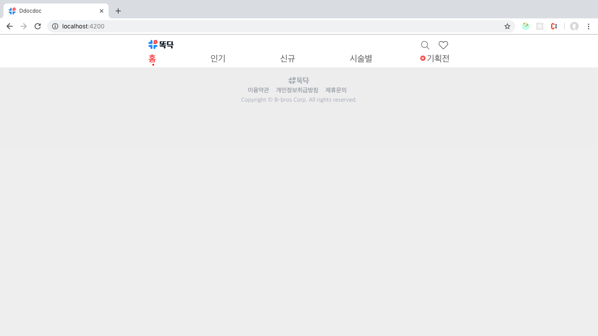
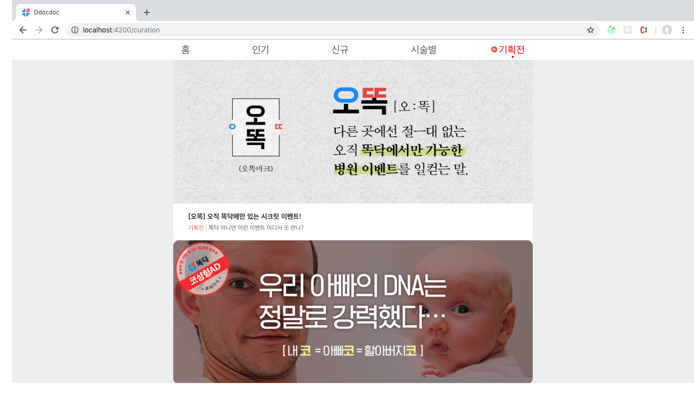
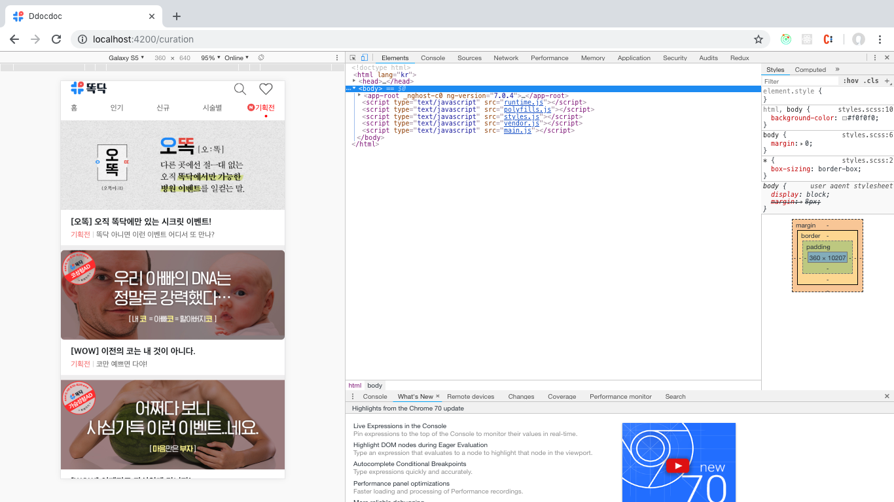

# Ddocdoc

------

### 사용한 기술 스택

- Angular : 7.0.0
  - CLI : 7.0.6
- Rxjs : 6.3.3
- Ngrx  :6.1.2
  - Store
  - effects
- Language
  - Typescript
  - CSS / SCSS

### 시작하기

```
npm i
```

### 개발용 서버

```
ng serve
```

##### 주소 : http://localhost:4200/

### 요구사항

- https://event.ddocdoc.com/curation 구현
- https://api.ddocdoc.com/v2/eventBanner?populate=true API를 이용
- Origin React -> Angular
- @ngrx/store 과 @ngrx/effects를 사용
- 모바일 화면 기준 (# PC화면도 구현함)
- 각 리스트 아이템은 https://event.ddocdoc.com/curation/_curationID_ 를 TargetURL로 잡음 (오리지널 페이지로 연결)

------

### 결과



#### <메인 페이지>

Header(GNB 포함)와 Footer은 StaticLayout으로 지정 해뒀습니다.

NavBar은 Active시 특정 UI를 바꾸는 기존 페이지걸 가져왔으며, NgRouter를 이용했습니다.




#### <Ceration (기획전) 페이지>

기존 오리지널 페이지를 Angular로 똑같이 구현했습니다.

아이템 클릭시 오리지널 페이지의 하위 URL로 리다이렉트 됩니다.




#### <Ceration Page (Mobile 반응형)>

원래 요구사항이던 모바일입니다.

나머지는 위 내용과 같습니다.

------

### 아쉬웠던 점

###### **진행도중 CORS Issue가 발생하여 막힌 감이 있었습니다.**

HttpHeader Option을 설정했음에도 CORS가 발생하여 헤매였던 점이 있었습니다.

크롬 브라우저에 CORS를 disabled 시켜주는 [플러그인](https://chrome.google.com/webstore/detail/allow-cors-access-control/lhobafahddgcelffkeicbaginigeejlf/related?ref=s)이 있어 설치한 후 실행했더니 잘 동작했습니다.

확실하지 않지만 API Server에서 Response Header에 **Access-Control-Allow-Origin**옵션을 주지 않았을거라고 생각합니다.

이는 서로 다른 도메인을 사용하여 개발시에는 문제가 되지만 배포 후에 사용자가 사용할 때에는 문제가 되지 않을겁니다.


##### **욕심을 참은 것**

욕심으로는 **/curation/:params** 부분도 만들고 싶었지만, 여유롭게 끝내고 싶은 마음(이와 같이 README 정리 등)과 하다 조금이라도 막힌다면 안 한만 못할 것 같다는 판단이 들어서 진행하지 못 한점이 좀 아쉽습니다.

------

### 느낀 점

 간만에 Angular를 쓰면서 Flux 아키텍처와 Redux를 본따 rxjs기반으로 만든 ngrx를 사용해봤는데, 나름 흥미진진했던 것 같습니다.

 Redux와 비슷한 듯 비슷하지 않은 점에서 골머리를 썩혔습니다만, 좋은 경험으로 남을 것 같습니다.

##### 